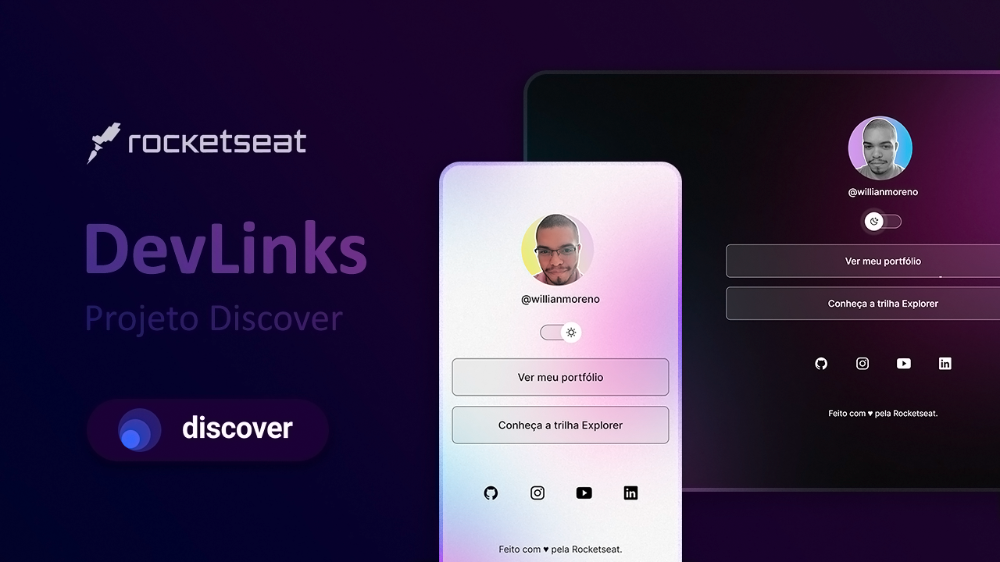

Eae, Dev! 👊🏾

Seja bem vindo(a) ✨🚀

<h1 align="center">DevLinks</h1>
<h3 align="center">Trilha Discover - Rocketseat</h3>

<h3>📌 Sobre</h3> 

O projeto DevLinks é um portfólio/agregador de links do desenvolvedor, que possui a funcionalidade de trocar de tema, além de ser responsivo!

<h3> 📌 Tecnologias</h3> 

- HTML, CSS, JavaScript;
- Git;
- Figma;

<h3> 📌 Considerações</h3> 

O projeto foi um ótimo consolidador de conhecimentos já adquiridos, uma forma eficaz de testar minhas habilidades, além de ter me desafiado ao construir, por exemplo, o componente switch sem auxílio de qualquer framework. Utilizei ferramentas do navegador para inspecionar as proporções do design system. Fica a dica de utilizar o plugin do navegador chamado 'VisBug' 😆.
